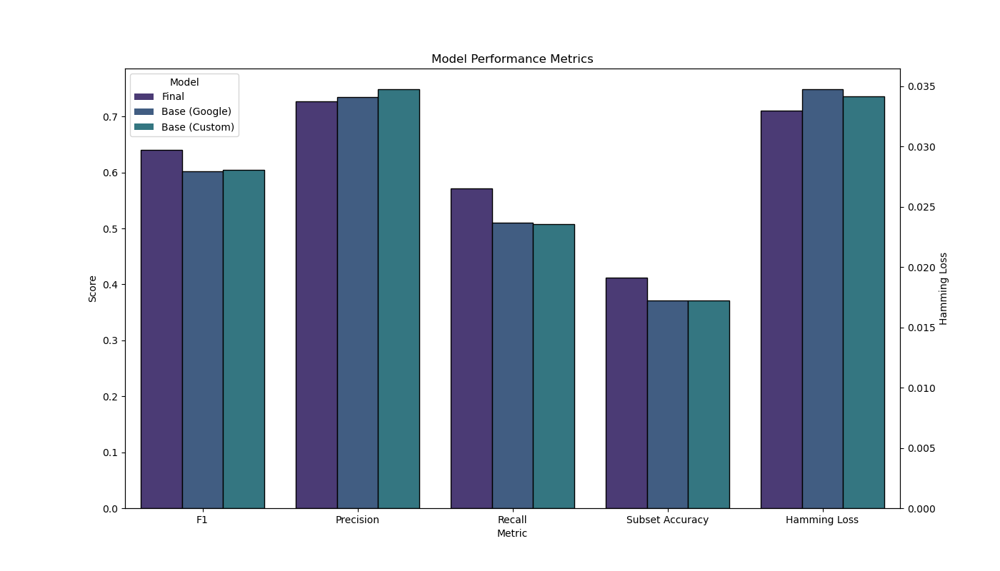

# Math Stack Exchange Question Classifier

## Overview
This project involves the development of a deep learning model to automatically classify questions from Math Stack Exchange into their respective fields. The classifier leverages a Long Short-Term Memory (LSTM) network to handle the multilabel classification problem, where each question can be associated with multiple tags.

## Motivation
With the increasing volume of content on platforms like Math Stack Exchange, efficient organization and categorization of questions are crucial. Manual classification can be inconsistent and labor-intensive. This project aims to automate the classification process, enhancing user experience by improving searchability and providing insights into the distribution of mathematical inquiries.

## Data Collection
- **Source:** Math Stack Exchange
- **Method:** Web scraping using Python libraries such as BeautifulSoup and requests
- **Volume:** Approximately 235,000 questions, targeting the top 30 tags
- **Tags:** Examples include calculus, linear algebra, probability, etc.

## Data Preprocessing
- **LaTeX Handling:** Replaced LaTeX expressions with a placeholder `<LATEX>` tag
- **Tokenization:** Used NLTK tokenizer to split text into lowercase words

## Model Design
### LSTM Architecture
- **Layers:** Two-layer LSTM with dropout layers for regularization
- **Input:** Maximum sequence length of 500 words
- **Hyperparameters:** Learning rate, dropout rate, batch size, number of hidden LSTM units

### Evaluation Metrics
- **Primary Metric:** Micro-averaged F1 score
- **Secondary Metric:** Precision, to handle the impact of false positives in sparse outputs

### Word Embeddings
- **Custom Embedding:** 300-dimensional Word2Vec embedding trained on the dataset
- **Pre-trained Embedding:** Google’s Word2Vec model trained on Google News
- **Chosen Embedding:** Custom embedding performed slightly better on evaluation metrics

## Results
- **Final Model Performance:**
  - F1 Score: 0.64
  - Precision: 0.73
- **Comparison:** Final model outperformed base models using both custom and pre-trained embeddings

## Repository Structure
- `data/`: Contains the raw and processed data files
- `figs/`: Figures generated in notebooks
- `models/`: The LSTM-based model as well as some models from previous iterations
- `report/`: An in-depth report detailing the project and results